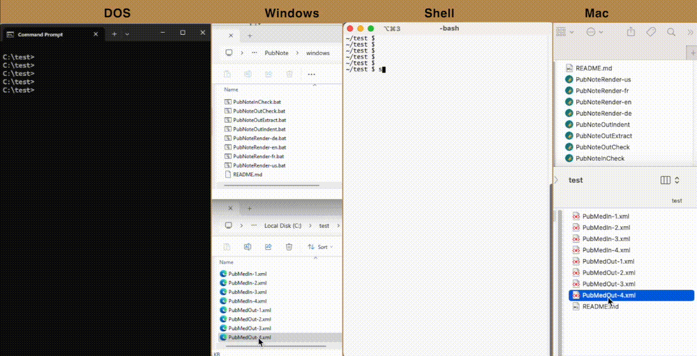
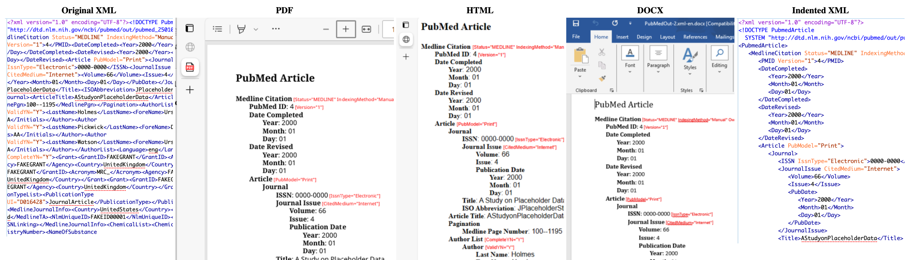
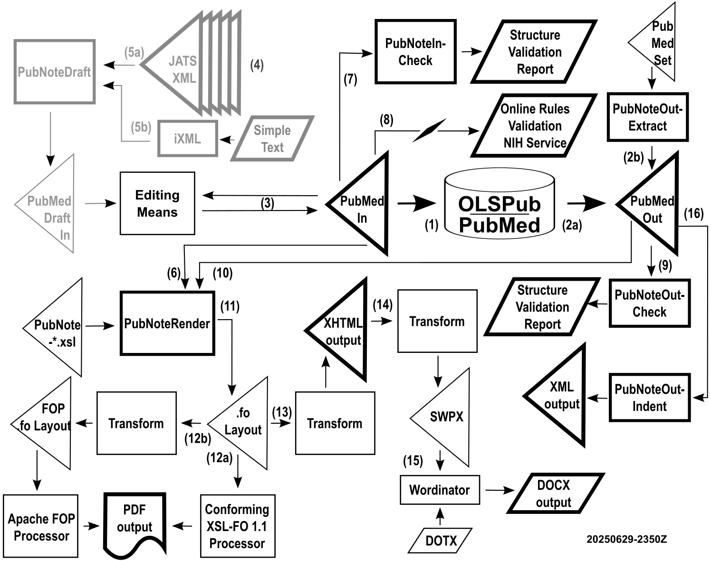

# \<PubNote> - a project in support of OLSPub and PubMed users

\<PubNote> is an open-source resource for visualizing, preparing, and working between the angle brackets of XML metadata content that is submitted to and distributed from [OLSPub](https://www.zbmed.de/en/research/current-projects/olspub) in Europe and [PubMed](https://pubmed.ncbi.nlm.nih.gov/) in the US.

\<PubNote> is conceived, initiated, and maintained by Ireland-based [Réalta Online Publishing Solutions Limited - https://RealtaOnline.com](https://RealtaOnline.com). Réalta is a purveyor of fast, accurate, and quality online and API publishing services for tailored single-source JATS XML publishing with high fidelity to PDF, HTML, and DOCX output formats. _[Contact us](mailto:support@RealtaOnline.com) for your off-site online JATS publishing needs without the maintenance of on-site publishing software._

\<PubNote> consists of these out-of-the-box XML metadata tools:

- **PubNoteInCheck** – validation of PubMed submission XML against the submission DTD  
- **PubNoteInDraft** – drafting of PubMed submission XML from JATS article XML _(part of Phase 2 of this project)_
- **PubNoteOutCheck** – validation of PubMed distribution XML against the distribution DTD  
- **PubNoteOutExtract** – extraction of PubMed distribution XML documents from a set XML document  
- **PubNoteOutIndent** – indentation of PubMed distribution XML documents from a single or a set XML document  
- **PubNoteRender-xx** – visualization of PubMed submission or distribution XML to PDF, HTML, and DOCX with multiple rendering choices
  - "-en"=English (A4), "-us"=English (US-letter), "-de"=German, "-fr"=French _(others welcome!)_

\<PubNote> works in four user interfaces, shown in this example where the file `PubMedOut-4.xml` (copied from the repository test directory to a base directory also named "test") is being rendered using `PubNoteRender-de` (found in the user Crane's local copy of this git repository) _(click image to make larger)_: 

- illustrated DOS invocation: `u:\git\crane\PubNote\windows\PubNoteOutRender-de.bat PubMedOut-4.xml`  
- illustrated shell invocation: `sh ~/u/git/crane/PubNote/shell/PubNoteOutRender-de.sh PubMedOut-4.xml`  

\<PubNote> publishes the [original PubMed XML](test/PubMedOut-2.xml) with multiple-language labels (shown here in English) in [PDF](test/PubMedOut-2/PubMedOut-2.xml-en.pdf), [HTML](test/PubMedOut-2/PubMedOut-2.xml-en.html), [DOCX](test/PubMedOut-2/PubMedOut-2.xml-en.docx), and, if useful, [indented XML](test/PubMedOut-2/PubMedOut-2.indent.xml), without disturbing the original XML _(click image to make larger)_: 

The [`test/`](test/) directory has anonymized sample PubMed in (submission) and out (distribution) XML files for testing.  _You can copy these XML files into a temporary directory outside of the git repository and use them for tests._

This test directory also includes the results of all invocations, found in subdirectories, so that you can see all the completed reports without having to execute anything.

To install \<PubNote> as a GitHub user, simply clone or fork the repository to a local repository on your system:

`git clone https://github.com/realtaonline/PubNote.git`

You can then invoke the tools directly from the appropriate `shell/` or `windows\` subdirectories, or use drag-and-drop as shown above. No build step is required, however, you do need Java 11 or higher installed in your environment.

If you are not a GitHub user and you can live without Mac drag-and-drop, you can also download \<PubNote> as a ZIP file by clicking the green **\<> Code** button on the [GitHub repository page](https://github.com/realtaonline/PubNote) and choosing **Download ZIP**. Again, no build step is required, though Mac drag-and-drop won't work. Windows drag-and-drop should work as expected, though some users report problems after installing the ZIP on a networked drive.

---

## Executive background

For years the US-based [PubMed](https://pubmed.ncbi.nlm.nih.gov/) has grown to be a resource of over 38 million citations of published biomedical literature. Each abstract is available from PubMed as a summary XML document valid against a simple abstract-oriented [DTD for distribution](https://pubmed.ncbi.nlm.nih.gov/download/#documentation). The PubMed system itself only accepts summary XML documents valid to a different simple abstract-oriented [DTD for submission](https://www.ncbi.nlm.nih.gov/books/NBK3828/#publisherhelp.PubMed_XML_Tagged_Format).

It is estimated that 8 million of these citations are to journal articles authored in JATS XML to satisfy the inclusion requirements in the PubMedCentral (PMC) and European PMC databases, to satisfy US National Institute of Health (NIH) public access policy for such inclusion, or already satisfying the use of JATS internally by publishers even when not publicly shared as an XML document.

In Europe in May 2025, the new [OLSPub](https://www.zbmed.de/en/research/current-projects/olspub) (Open Life Sciences Publishing) project was established by the publicly-funded ZB Med in Germany. This project strives to protect the wealth of information in PubMed in a parallel open database maintained outside of US jurisdiction. Ready for the future, the project already contains all existing PubMed data and is ready for any additional data publishers may wish to contribute directly. That project is getting a lot of attention.

This \<PubNote> project, conceived in the spirit of OLSPub for jurisdictional independence, open data, and publisher empowerment, is an open-source resource for working with PubMed metadata.

The entire visualization code base for \<PubNote> is oriented around simple and shallow metadata XML documents, a contrasting nature to the rich and deep JATS document model. Whereas JATS describes elaborate prose-oriented nested structures intended for branded distribution, PubMed describes only flat metadata structures intended only for internal reviews, indexing, and search.

Nevertheless, these simple PubMed metadata structures are in arcane XML syntax which can be discomfiting to some users who may be allergic to angle brackets. \<PubNote> seeks to make working with and reviewing the content of these structures easy for all users.

In summary, \<PubNote> aligns with OLSPub's objectives by offering open-source tooling to validate and inspect the XML metadata formats used in its submission and distribution workflows. The tool aims to aid metadata quality assurance and empower non-technical contributors, thus improving their trust in meeting specialized XML obligations.

---

## Data flows

The basic flows interacting with OLSPub and PubMed are simple:

1. A valid **PubMedIn** XML submission document is forwarded for inclusion in the OLSPub and/or PubMed database  
2. A valid **PubMedOut** XML distribution document is obtained for processing  
2a. exported directly from the OLSPub and/or PubMed database according to some criteria, or  
2b. extracted (with or without added indentation) using the **PubNoteOutExtract** process against one or more valid PubMedOut XML distribution documents, such as from an ~200MB XML single article set document of 30,000 article documents unpacked from a ~20MB ZIP file from the [PubMed FTP site](https://pubmed.ncbi.nlm.nih.gov/download/)

The \<PubNote> visualization/validation environment wraps around these two "in/submission" and "out/distribution" XML documents, giving users tools to create, confirm, and consume the information.

3. Presumably, there is some editing process for the user's **PubMedIn** submission document  
4. Optionally, the user uses **PubNoteDraft** to create a **PubMedDraftIn** document as a starting point _(Phase 2)_  
5a. e.g. from a distillation of multiple JATS XML documents into a draft, or  
5b. e.g. from a simple text file with no angle brackets converted to XML using Invisible XML    
6. For human review, **PubNoteRender** formats the information found in a **PubMedIn** document  
7. Optionally, **PubNoteInCheck** can validate a **PubMedIn** document against the `PubMed.dtd`  
8. Optionally, a **PubMedIn** document can be checked using the NIH online business rules validator  
9. Optionally, **PubNoteOutCheck** can validate a **PubMedOut** document against the `pubmed_250101.dtd`  
10. For human review, **PubNoteRender** formats the information found in a **PubMedOut** document  

The visualization process then takes the **XSL-FO output** from **PubNoteRender** to produce human-readable documentation:

11. XSL-FO is created with all of the content to be presented downstream in PDF, HTML, and DOCX  
12. XSL-FO is transformed into **PDF** for print purposes  
12a. A conforming XSL-FO 1.1 processor directly produces the output _(not part of this repository)_  
12b. A non-conforming XSL-FO 1.1 process requires a transformation to make a suitable subset XSL-FO  
13. XSL-FO is transformed into **XHTML** for browser display  
14. XHTML is transformed into **SWPX** (Simple Word Processing XML) for word processing purposes  
15. The **Wordinator** tool combines SWPX and a Microsoft **DOTX** template to produce a **DOCX** file
16. Optionally, **PubNoteOutIndent** processes a **PubMedOut** document into an indented XML output

---

## Maintenance, feedback, and the future

For questions, suggestions, comments, and contributions we invite you to create issues and pull requests, both of which are accessible in tabs in the GitHub web page header.

In particular, improvements and additions to the label language translations for [xsl/xlate/](xsl/xlate/) are most welcome.

Phase 2 of the project development will proceed when end-user requirements are gathered, and when these Phase 1 visualization and validation resources get more visibility.

At this time the project manager is [G. Ken Holman](mailto:gkholman@CraneSoftwrights.com), a [long-time XML community contributor](https://linkedin.com/in/gkholman) and the XML Technology Lead at [Réalta Online Publishing Services Ltd.](https://RealtaOnline.com) Ken's conference papers at [JATS-Con 2020/21](https://www.ncbi.nlm.nih.gov/books/NBK556169/) and [JATS-Con 2023](https://www.ncbi.nlm.nih.gov/books/NBK591971/) offer some insights into the implementation of this project using principles found in Réalta's JATS publishing service offering.